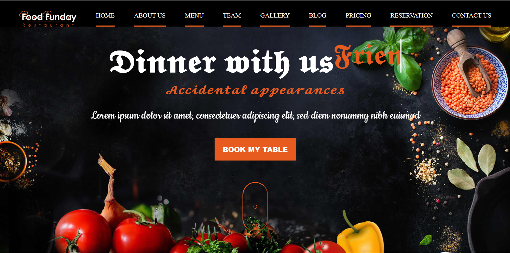
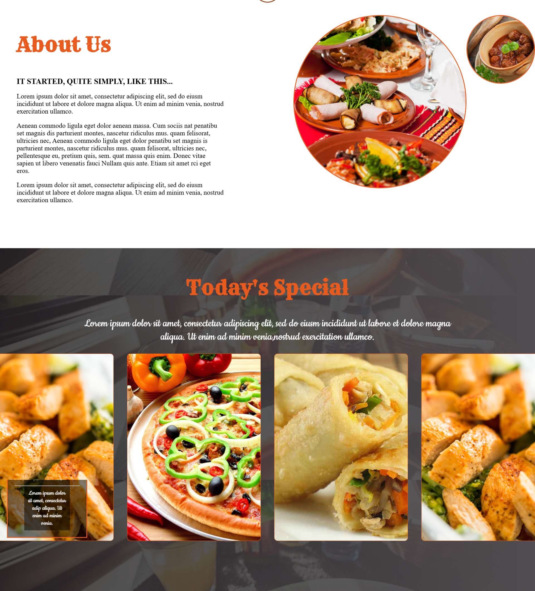
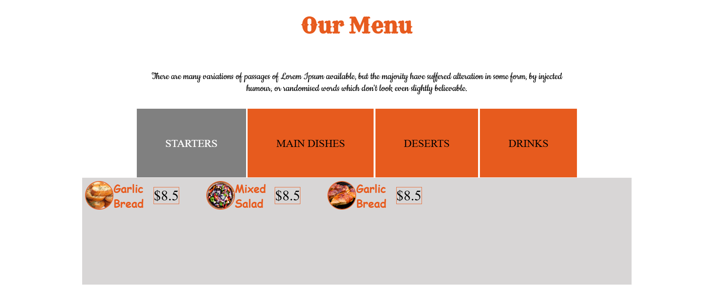
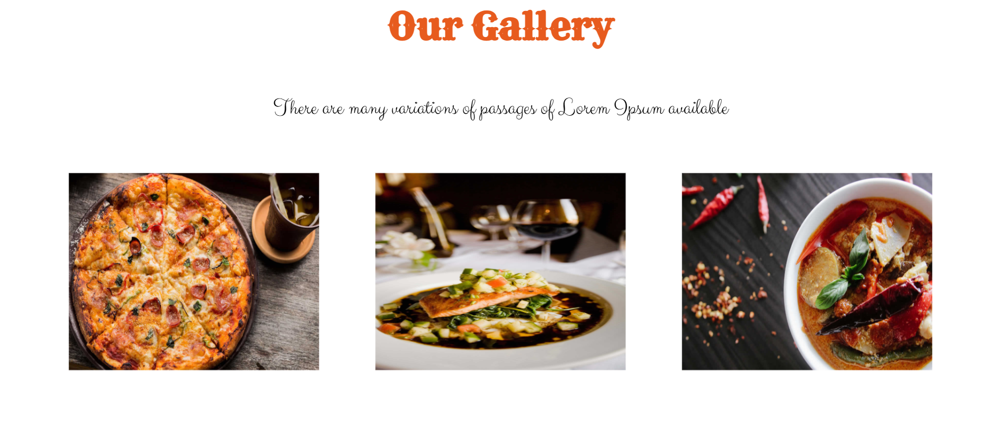
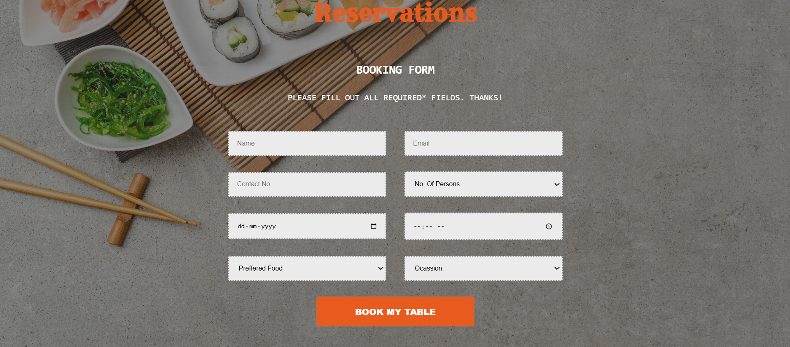

# Restaurant Website

<div align="center">



### A responsive restaurant website built with HTML, CSS, and JavaScript.

[](https://dineshkumar24v.github.io/Html_Css_PROJECT/)
[](#tech-stack)
[](#tech-stack)
[](#tech-stack)

</div>

## Overview

This project is a polished restaurant landing website designed to present a complete dining brand experience. It includes a hero section, about content, today's special dishes, menu categories, chef profiles, gallery, blog previews, pricing cards, table reservation, newsletter, and contact/footer sections.

The goal of this project is to demonstrate frontend development skills through a visually rich, responsive, multi-section website using only core web technologies.

## Recruiter Highlights

- Built a complete static website using semantic HTML, custom CSS, and JavaScript.
- Designed a responsive layout across desktop, tablet, and mobile breakpoints.
- Created a strong restaurant brand presentation with hero visuals, food gallery, menu cards, and reservation flow.
- Added interactive navigation behavior with JavaScript to highlight the active page section while scrolling.
- Organized the project into reusable assets, separate menu pages, and screenshot documentation.
- Used CSS animations, transitions, grid, flexbox, and media queries for a modern user experience.

## Live Demo

View the deployed project here:

**[Restaurant Website Live Preview](https://dineshkumar24v.github.io/Html_Css_PROJECT/)**

## Screenshots

### Home Page


### About and Today's Special



### Menu Section



### Food Gallery



### Reservation and Contact



### Full Page Preview


## Features

- Responsive restaurant landing page
- Fixed navigation with active section highlighting
- Hero section with call-to-action button
- About section with image-based layout
- Today's special food showcase
- Dedicated menu pages for starters, main dishes, desserts, and drinks
- Chef/team profile section
- Image gallery for food and restaurant visuals
- Blog preview cards
- Pricing and reservation sections
- Newsletter and contact/footer layout

## Tech Stack

| Technology | Purpose |
| --- | --- |
| HTML5 | Page structure and content |
| CSS3 | Styling, layout, responsiveness, animations |
| JavaScript | Scroll-based active navigation behavior |

## Project Structure

```text
Html_Css_PROJECT/
|-- index.html
|-- starters.html
|-- maindish.html
|-- deserts.html
|-- drinks.html
|-- style.css
|-- script.js
|-- images/
`-- screenshots/
```

## Pages Included

| Page | Description |
| --- | --- |
| `index.html` | Main restaurant landing page |
| `starters.html` | Starters menu page |
| `maindish.html` | Main dishes menu page |
| `deserts.html` | Desserts menu page |
| `drinks.html` | Drinks menu page |

## Getting Started

This is a static frontend project, so no installation or dependencies are required.

1. Clone or download the repository.
2. Open `index.html` in your browser.

PowerShell:

```powershell
cd "C:\Html_Css_PROJECT"
start index.html
```

## Skills Demonstrated

- Responsive web design
- HTML page structuring
- CSS layout with flexbox and grid
- CSS media queries
- UI styling and visual hierarchy
- JavaScript DOM selection and scroll events
- Multi-page static website organization
- Asset and screenshot documentation

## Author

Created as a frontend development project to showcase HTML, CSS, and JavaScript skills through a complete restaurant website experience.